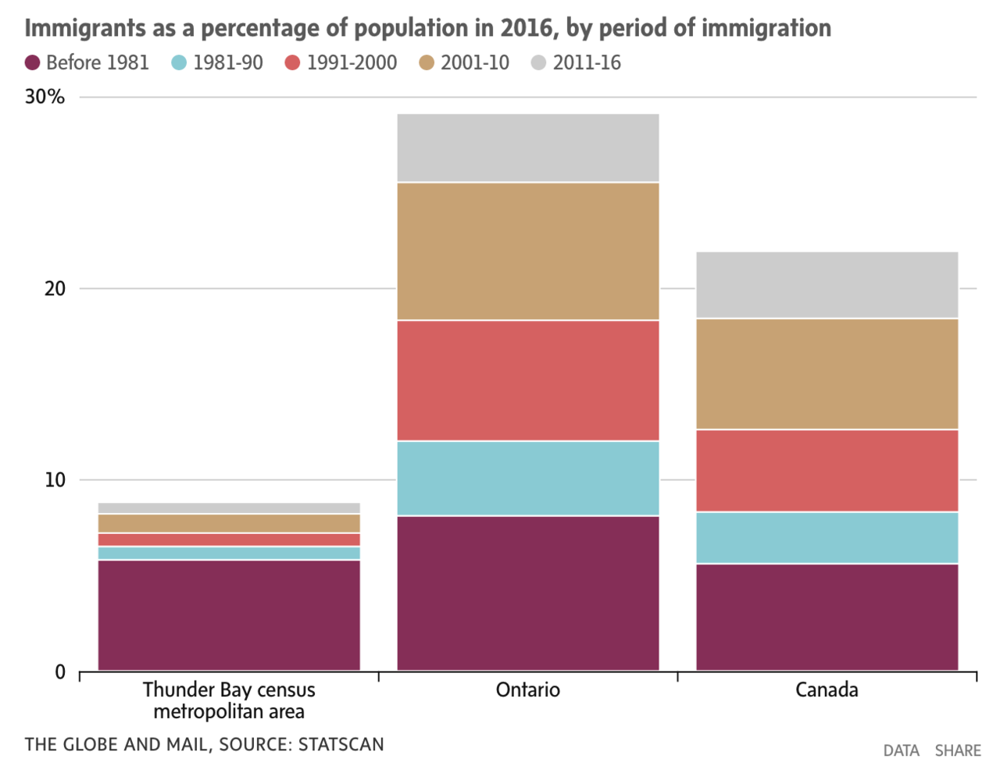
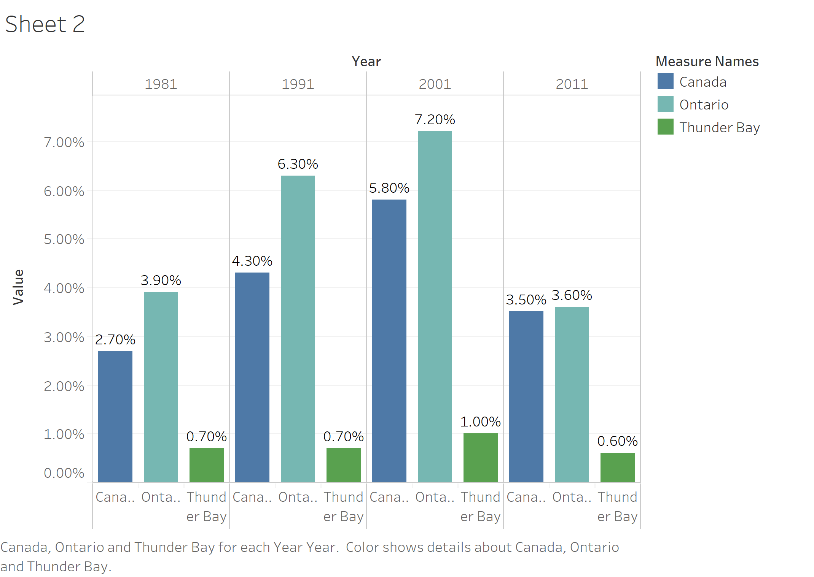
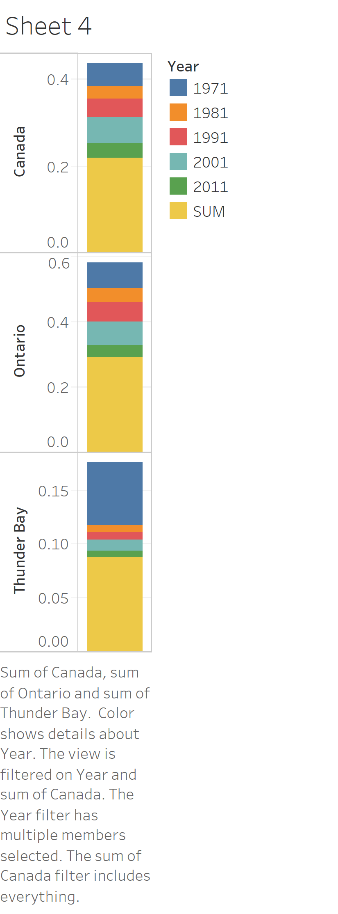
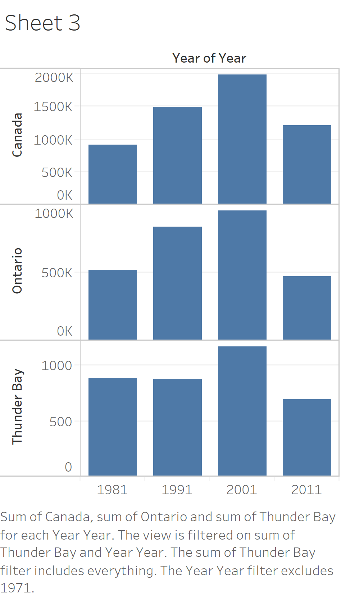
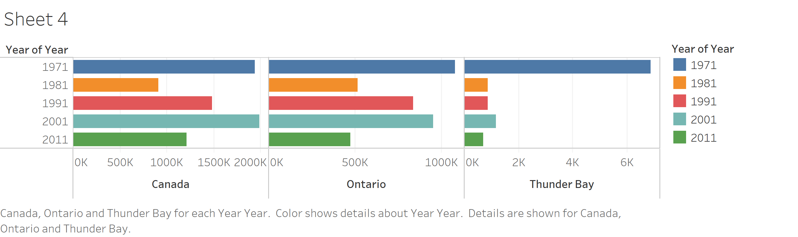
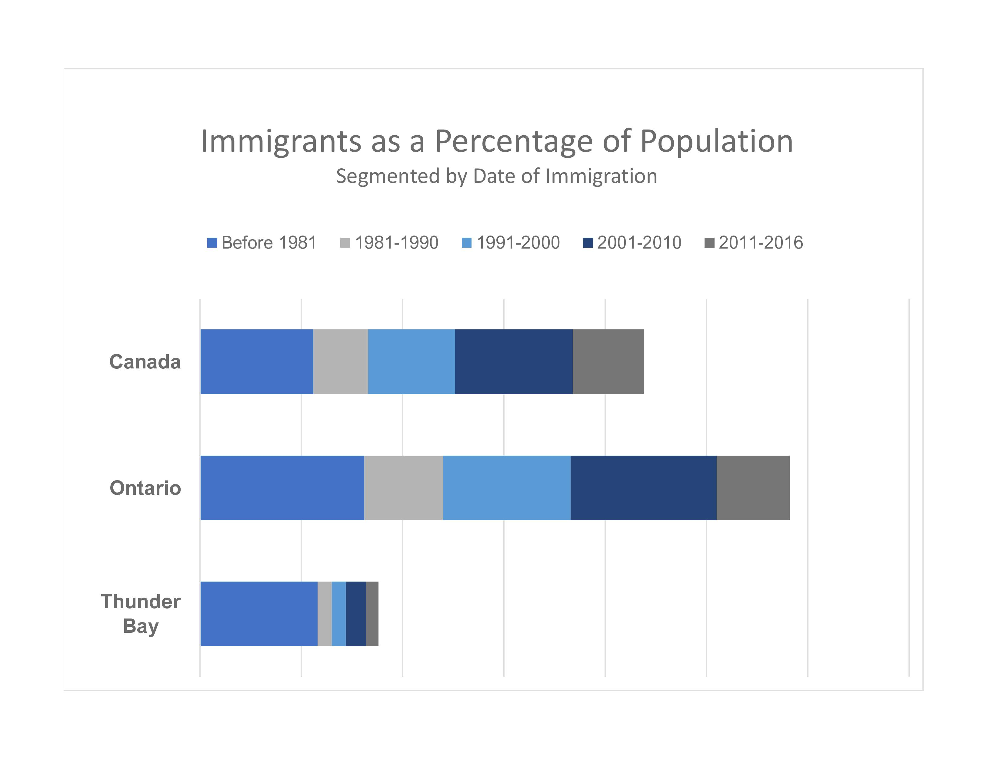

# Assignment 3 and 4: Critique by Design

## Step One
For this assignment, I took the easy route and Googled "terrible data viz". 

I quickly found one on WTF Visualizations that I thought would be fun to work with: 

Unfortunately, I was not able to find the original article that this was created to accompany. However, I was able to find the original data set on [Stat Can](https://www12.statcan.gc.ca/census-recensement/2016/dp-pd/prof/details/page.cfm?Lang=E&Geo1=CMACA&Code1=595&Geo2=PR&Code2=35&SearchText=ontario&SearchType=Begins&SearchPR=01&B1=Immigration%20and%20citizenship&TABID=1&type=0). 

## Step Two
###### Here are my initial thoughts about the visualization: 
What stood out to me immediately was:  there is a marked difference between the Thunder Bay area, Ontario, and Canada. The visualization does a good job of making that first flash point very clear. However, the details of exactly what is different took quite a long time to suss out. 

Though I normally wouldn't say this, I think the chart is too large and the title/legend is too small. I immediately saw the basis of the story (there is a marked difference that is significant in some way) but it took me too long to understand the context because the text is almost hidden. I didn't even realize I was looking at percentages until a few minutes in. 

Splitting the current percentages into decades is also very confusing. I understand now why it adds to the story because there is a change over time, but there is likely a much more simple way to convey the information. 

Lastly, I'm not sure it's necessary to compare our data point of interest (Thunder Bay) to both Ontario and Canada as a whole. I want to consider that more. 

## Step Three

I really struggle with pen and paper, so I actually created very rough drafts in tableau to serve as my wireframes. I did not take the time to adjust all the labels and details. Here are some of my disastrous first iterations: 

Finally, I gave up and went back to excel. 

