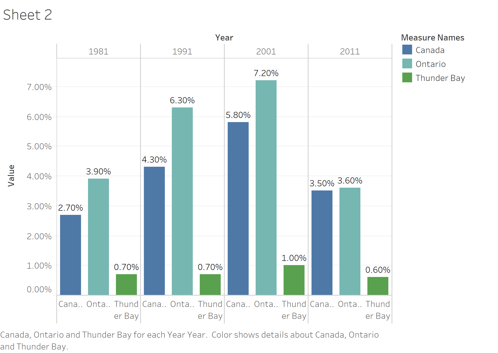
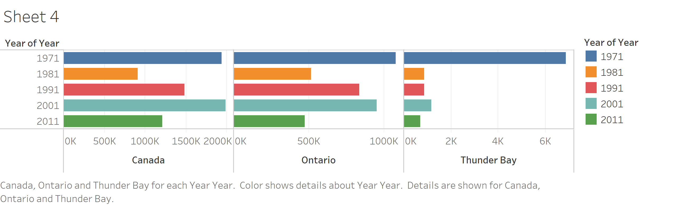

# Assignment 3 and 4: Critique by Design
###### The purpose of this assignment was to find a data visualization that could use some improvement, critique it, and then attempt to re-design it by creating a new visualization. Below is the summary of my process.

### Step One
For this assignment, I took the easy route and Googled "terrible data viz". 

I quickly found one on WTF Visualizations that I thought would be fun to work with: 

Unfortunately, I was not able to find the original article that this was created to accompany. However, I was able to find the original data set on [Stat Can](https://www12.statcan.gc.ca/census-recensement/2016/dp-pd/prof/details/page.cfm?Lang=E&Geo1=CMACA&Code1=595&Geo2=PR&Code2=35&SearchText=ontario&SearchType=Begins&SearchPR=01&B1=Immigration%20and%20citizenship&TABID=1&type=0). 

### Step Two
###### Here are my initial thoughts about the visualization: 
What stood out to me immediately was:  there is a marked difference between the Thunder Bay area, Ontario, and Canada. The visualization does a good job of making that first flash point very clear. However, the details of exactly what is different took quite a long time to suss out. 

Though I normally wouldn't say this, I think the chart is too large and the title/legend is too small. I immediately saw the basis of the story (there is a marked difference that is significant in some way) but it took me too long to understand the context because the text is almost hidden. I didn't even realize I was looking at percentages until a few minutes in. 

Splitting the current percentages into decades is also very confusing. I understand now why it adds to the story because there is a change over time, but there is likely a much more simple way to convey the information. 

Lastly, I'm not sure it's necessary to compare our data point of interest (Thunder Bay) to both Ontario and Canada as a whole. I want to consider that more. 

### Step Three

I really struggle with pen and paper, so I actually created very rough drafts in tableau to serve as my wireframes. I did not take the time to adjust all the labels and details. Here are some of my disastrous first iterations: 

Finally, I gave up and went back to excel (just for now I promise)

### Step Four
I tested my wireframes on my coworker and they were just as confused by my solution as the original visualization. I suppose this makes sense, since I really only flipped the axes and changed the colors. This is proving more difficult than I anticipated. I think my lack of understanding about the story the original visualization was trying to tell made it more difficult for me to work through creating my own solution. 
My coworker had the same initial problems I had: not being able to glean the information necessary to interpret the message. I think I need to re-think my approach. 

### Step Five
In the end, I came up with two possible solutions, neither of which I am very happy with. 

For the first, I made the very bold choice to try a Bar of Pie chart. What I like about this one is I think it helps the reader understand the context of the percentages they're seeing. Both my reviewer and I had trouble understanding that the date of immigration was a category of a current percentage. I think this helps clarify that we're looking at the breakdown of a segment of the population. What I don't like is that it's a bit clunky, and I think there may be too much information trying to be conveyed. 

For the second solution, I took the original visualization and tried to remove all unnecessary details to distill the message. I also experimented with using more text to better explain and summarize what the reader is looking at. I think it does succeed in distilling the idea. I think where it falls short is making it clear that we are segmenting percentages of a population. 

Overall, this was a very tough exercise for me and really gave me a deeper level of sympathy and understanding for whoever created that first terrible visualization. I'm not sure I could have done much better. 
**********************
[<< View Previous      ](/Assignment_2.md)[View Next >>](/Final_Project_1.md)

[Return Home](/README.md)
