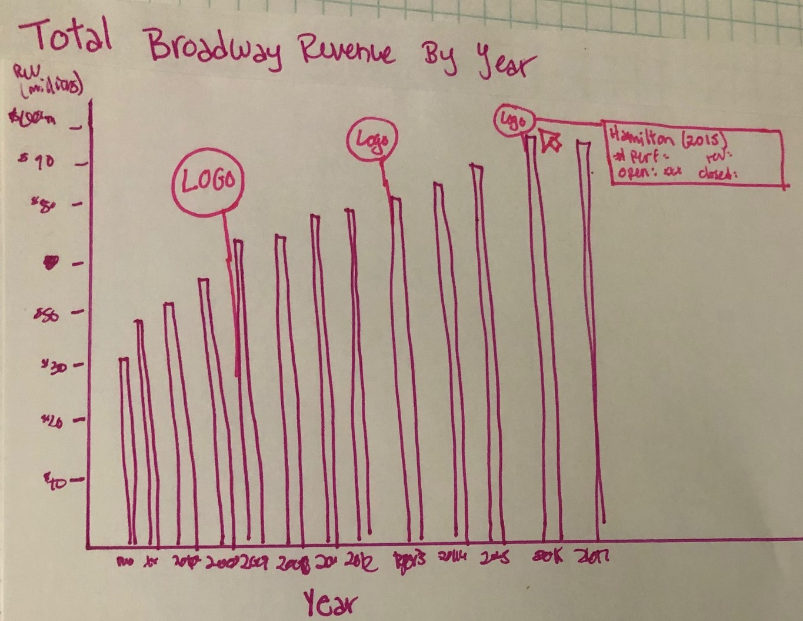
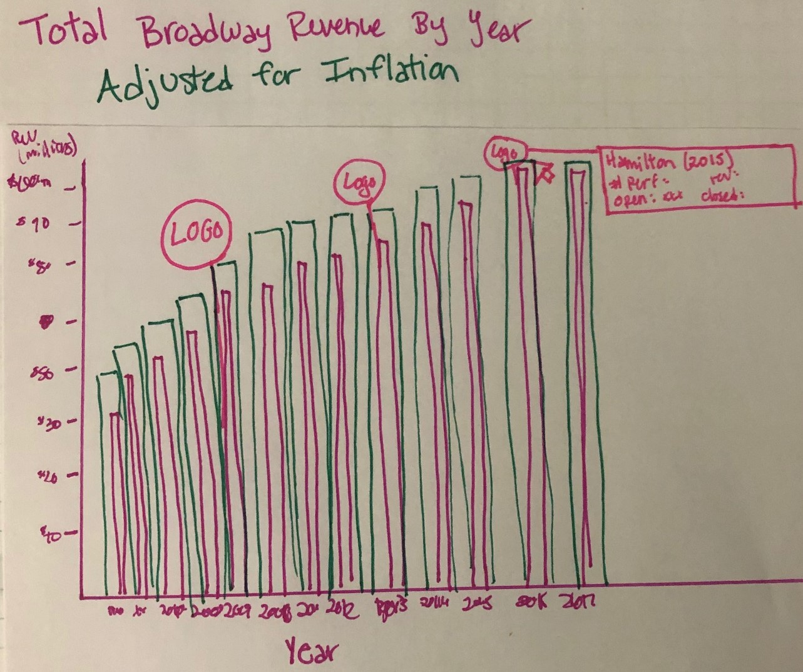
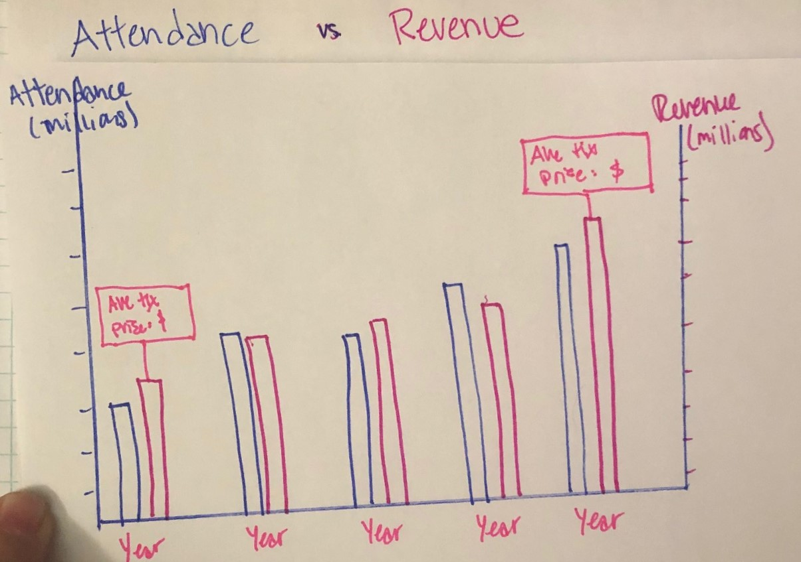
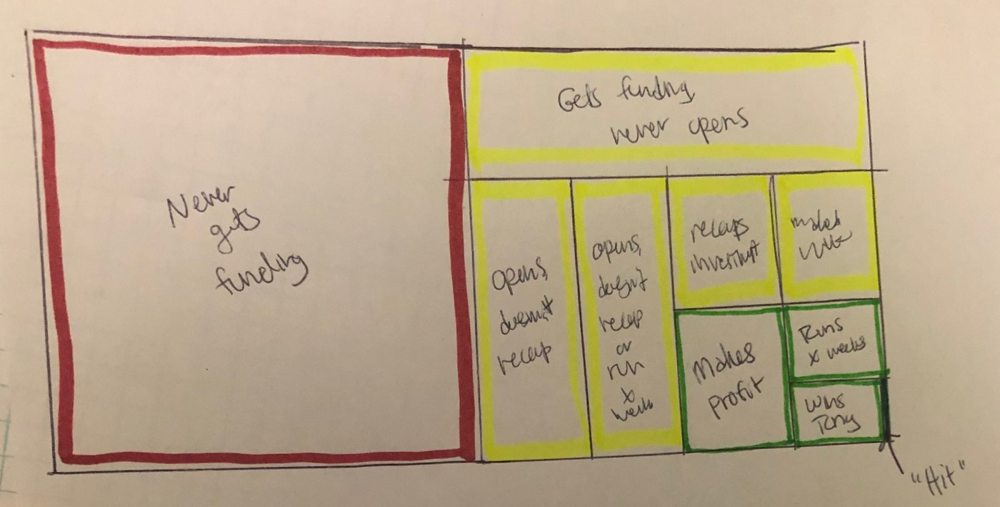
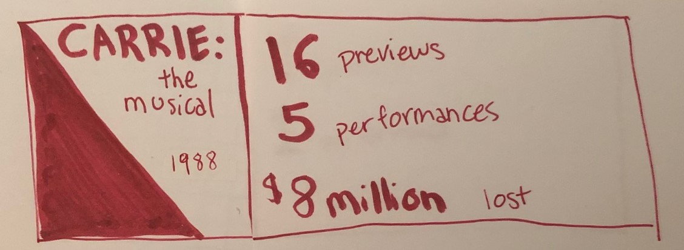

# Final Project

## Part One: Project Proposal

### Rationale
As an arts management student with a theatre background, I wanted to develop a project centered around theatre. The simplest and most significant data that we gather in theatre revolve around attendance, ticket sales, and revenue. Although my personal interest is in non-profit theatre companies, there is more complete data available for commercial Broadway shows. I determined that I could likely tell an interesting story about the success of commercial arts over the past three decades that would hopefully speak to a general audience.

As I developed the story, I decided to include a final section that connects the results of commercial theatre to non-profit theatre to serve as a call to action for the audience to support the arts taking place in their own neighborhood. 

### Project Outline
This project aims to interrogate the theory that live theatre no longer has a place in modern society by identifying trends in yearly attendance and revenue for Broadway shows over the past four decades, both in New York and on tour. 
There are five main sections of the story: 

#### One: Introduction
The project will begin by hooking the intended audience with a provocative question: **Is theatre a dying artform?** One or two key images will enhance the message and help pique the interest of the audience. A very brief (two-three sentence) summary will then introduce the topic more fully and make the scope of study more clear. 

#### Two: Broadway Revenues
The next section will feature a simple data visualization showing the rise in revenues on Broadway over the past few decades. This will likely be a simple bar chart. The chart will also feature call-outs of popular productions that broke into mainstream popular culture, such as Hamilton, Wicked, and the Lion King. 

{:height="70%" width="70%"}

Next, the same visualization will be adjusted to account for inflation. I am actually interested to see how this changes the results, whether a clear rise is still evident or the rise is almost exactly equal to inflation of the American dollar. 

{:height="70%" width="70%"}

Finally, a few sentences will summarize these results. 

#### Three: Broadway Attendance and Ticket Prices
This section will summarize attendance rates at Broadway shows, then compare them to revenues. The story of this section will really be determined by the information gleaned from the data. Specifically, I will be looking to see whether attendance is directly correlated to revenue, or if higher ticket prices may have inflated revenues without attendance rising. I may also create a visualization comparing average ticket prices over time, adjusted for inflation. 

{:height="70%" width="70%"}

#### Four: The Dark Side of Show Biz
Because the story of the first three sections has essentially been “the theatre industry is doing great!” this section will provide balance by providing some statistics about the shows that don’t make it to Broadway, and the risky nature of the industry. 
I am still determining the best type of visualization to tell this story, but I am currently envisioning an infographic highlighting some summary statistics and a treemap that shows how many shows make it past development, how many make it to certain milestones, how many recoup their investment, and how many become “hits”.  

{:height="70%" width="70%"}

To add some color to the story, I may follow up with one or two examples of famous Broadway flops, with images and captions. 

{:height="70%" width="70%"}

#### Five: The Non-Profit Sector
This section will shift the focus to non-profit theatre. It will first describe how the revenue streams differ from Broadway. Then, a visualization will show the growth of the non-profit theatre sector over time, measured by yearly revenue. 
This section will conclude with a call to action that empowers and encourages the audience to attend local theatre productions. 

### Data
The data about Broadway revenues and attendance comes from The Broadway League. The complete dataset can be found online at <https://broadwayleague.com/research/grosses-broadway-nyc/>

Further data about the economic state of Broadway, including notable financial successes and failures, will be collected from the Internet Broadway Database: <https://www.ibdb.com/>

Data about inflation will be taken from the Bureau of Labor Statistics' website: <https://stats.bls.gov/>

Finally, data about the economics of non-profit theatre companies comes from TCG's annual Theatre Facts report. All reports from 2000 to 2018 are available to download from <http://www.tcg.org/Default.aspx?TabID=1576> 

### Methods
I will be using Shorthand to create my final project. From a cursory exploration, it seems user-friendly enough for me to use to create a successful project that will be engaging, interactive, and informative. Especially since I'm using a lot of relatively simple chart types that may not immediately engage my audience, I want to make the entire presentation as interactive as possible. I am nervous about learning a new tool, but I'm confident in my storytelling skills. 

****************************

[<< View Previous](/Assignment_3_4.md) [View Next >>](/Final_Project_2.md)

[Return Home](/README.md)

